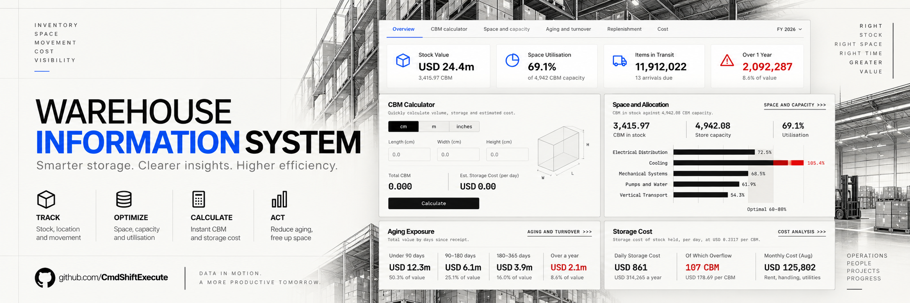
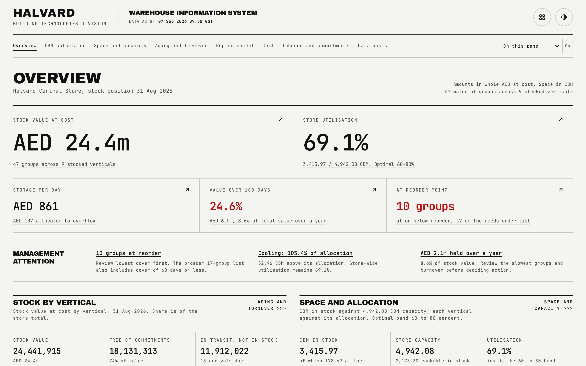

# Warehouse Management System

*A warehouse management system dashboard for a fictional engineering group, every figure from one seeded generator.*

## In one glance

- **What it answers**: is the stock safe and is the space paying for itself, expressed as stock value and utilisation, ageing exposure, ABC classification, replenishment cover and storage cost.
- **What is synthetic**: every figure, name and supplier code is generated from one fixed seed; no real company, person or warehouse appears anywhere in this repository.
- **How it is built**: one generator writes every published JSON table, a second script independently reconciles every cross-table figure, and the browser only sorts, filters, formats and (on the calculator page) recomputes from one shared CBM rule.

## What it is

A warehouse manager needs one question answered before any other: is the stock safe, and is the space paying for itself. This is a zero-backend warehouse management system dashboard that answers it for a fictional engineering group's central store: how much value is on the racks, how full the store is, what it costs per day, what is aging, and what will run out. Nine report pages plus a per-group detail page sit on top of finished JSON tables, all generated from one seed.

The design rule the whole app turns on: if a figure is wrong, the fix belongs in the generator, never in a component. A page only sorts, filters, formats and, on the calculator page only, recomputes from the one shared CBM (cubic-metre volume) rule what the generator already computed. Nothing else is calculated in the browser.

## Live demo

**[warehouse-management-system-dashboard.vercel.app](https://warehouse-management-system-dashboard.vercel.app/)**

## Highlights

- **47 material groups across a multi-vertical roster** (one vertical is deliberately empty), each carrying its own dimensions, price, demand and twelve months of stock history.
- **One shared CBM rule** drives the generator, the reconciliation script and the browser's live calculator, so a manual edit and a published figure can never disagree.
- **2,493 of 2,493 reconciliation assertions pass**, independently re-checked against the written JSON files rather than the generator's own memory, with the result published on the Data basis page.
- **50 published data files are byte-identical across two runs** of the same seed, because every stamped timestamp is fixed to one recorded instant rather than the clock time of the build.
- **140 of 140 interaction checks pass** against a real served build in a real browser: table sorting, chart view switches, a full keyboard traversal, and hostile-input handling on every calculator field.
- **A live CBM calculator** where editing a group's length, breadth, height or quantity recomputes its vertical's and the whole store's utilisation in front of you, with every retained edit kept per vertical rather than cleared on navigation.
- **A day-by-day depletion simulation** projects four months of stock forward, replenishing each group the moment its balance crosses its own reorder point, then replays the same rule independently as a reconciliation check.
- **Every allocation is exact to the reported decimal**: money sums as whole currency units, percentages that must total 100.0 are split by largest remainder, and CBM is carried in hundredths so no rounding residue can creep in.

## Pages

| Page | What it shows | Guide |
|---|---|---|
| Overview | Stock value and utilisation lead, then daily storage cost, aging exposure and reorder position, then one section per question | [docs/01-overview.md](docs/01-overview.md) |
| Space and capacity | Utilisation by vertical against its allocation, and the four-month space projection | [docs/02-capacity.md](docs/02-capacity.md) |
| Aging and turnover | Stock value by age band per vertical, the fifteen slowest-moving groups, turnover, and the ABC classification | [docs/03-aging.md](docs/03-aging.md) |
| Replenishment | Every material group sorted by least cover first, with groups at or under their reorder point marked | [docs/04-replenishment.md](docs/04-replenishment.md) |
| Cost | The month's cost split by vertical, storage cost by material group, and four site options on one template | [docs/05-cost.md](docs/05-cost.md) |
| CBM calculator | Edit a group's dimensions or quantity and watch the vertical and store totals move live | [docs/06-calculator.md](docs/06-calculator.md) |
| Inbound and commitments | Stock mapped to purchase orders against free stock by vertical, and every open in-transit arrival | [docs/07-inbound.md](docs/07-inbound.md) |
| Data basis | Sources, definitions, the precision policy, the assumptions, and the reconciliation result | [docs/08-data-basis.md](docs/08-data-basis.md) |
| Material group detail | One group's seventeen WMS fields, its CBM inputs, its age profile, its replenishment status, and twelve months of stock | [docs/09-material-group.md](docs/09-material-group.md) |

## The data behind it

Everything traces back to one script, `scripts/generate_demo_data.ts`, run from a single fixed seed (`20260912`). It builds the store's floor area and rent, the multi-vertical roster, every group's dimensions, price and demand, twelve months of history and the next four months of forecast, all in one deterministic pass. Nothing is looked up from a real warehouse and nothing is typed in by hand.

The precision policy is stated once and holds everywhere: money is an integer, rounded once at the material-group level, and every higher figure is a sum of those integers so tables that show the same number tie exactly. CBM is carried in hundredths so no floating-point residue can appear. Percentages are one decimal, computed from the summed totals rather than from other percentages, and any set of shares that must total 100.0 (ABC classes, value shares, age-band splits, the month's cost allocation) is assigned by largest remainder so it always does.

A second, independent script, `scripts/reconcile.ts`, re-reads every written file and checks that every figure appearing in more than one place agrees exactly, and that every derived figure follows the rule it claims to follow: 2,493 of 2,493 assertions pass, and the result renders in full on the Data basis page. A third gate hashes all 50 published files, regenerates them, hashes again, and fails on any difference, because a build that is not reproducible cannot be trusted to publish. All data is synthetic; no real company, person or figure appears anywhere in this repository.

Full detail: [docs/data-model.md](docs/data-model.md).

## Quality gates

| Command | What it proves |
|---|---|
| `bun run reconcile` | Every cross-table figure agrees, and every derived figure follows its stated rule: 2,493 of 2,493 assertions |
| `bun run stable` | The published data is byte-identical across two runs of the same seed: 50 files checked |
| `bun run typecheck` | The TypeScript compiler passes in strict mode across the project |
| `bun run lint` | oxlint passes across the source |
| `bun run motion` | Every drawn chart line matches the dash pattern Motion actually wrote, catching a stylesheet rule that would otherwise leave a line pre-drawn |
| `bun run contrast` | Every text pair clears 4.5:1 and every non-text mark clears 3:1, read straight from the stylesheet's own color tokens |
| `bun run interactions` | A real served build, driven by Playwright: sorting, chart view switches, a full keyboard traversal, hostile-input handling on the calculator, and zero console errors: 140 of 140 checks |
| `bun run check` | Chains `data`, `reconcile`, `stable`, `typecheck`, `lint`, `motion`, `build` and `contrast` in that order |

Full detail: [docs/quality-gates.md](docs/quality-gates.md).

## Design system

A brutalist, print-inspired interface built to read as an internal engineering system rather than a generic dashboard: square corners everywhere except the two circular icon-only suite controls, two self-hosted fonts (Archivo Black for every heading, JetBrains Mono for every label, table cell and line of prose, with tabular numerals so columns of figures align), and a paper-and-ink color set where a second print ink and its tint carry every chart mark, ring and bar. Hazard red is the one accent color in the system, and it is earned only by a real risk: a group below its reorder point, a vertical over its allocation, stock over a year old, a failed reconciliation assertion.

Three themes (Parchment, Light and Dark) carry the same semantic roles across every route and chart. Every chart that plots more than one reading of its data carries a view switch, remembered per chart, and every chart supports full keyboard operation: focus it, move a crosshair with the arrow keys, and hear the same reading a sighted user sees. One easing curve drives every transition in the app, at three tiers: the page fades and rises 6px on navigation, sections and table rows reveal on scroll, and every clickable control gives a small press on activation. All of it is disabled under reduced motion, checked twice, once in the stylesheet and once in the code, so neither on its own is the single point of failure.

Full detail: [docs/design-system.md](docs/design-system.md).

## Run it locally

1. `bun install` installs dependencies.
2. `bun run verticals` imports the multi-vertical roster from the sibling MIS demo's published index. One-shot; re-run only if that roster changes.
3. `bun run data` runs the generator and writes the published JSON tables under `public/data/`.
4. `bun run check` runs the full gate chain: data, reconcile, stability, typecheck, lint, motion, build and contrast.
5. `bun run dev` starts the development server.

## Sibling demos

This is one of three demos built for the same pitch, sharing one design system and one generator discipline:

- **[Management Information System](https://github.com/CmdShiftExecute/management-information-system)** ([live](https://management-information-system-dashboard.vercel.app/)), the management information system: revenue, pipeline, net profit and receivables.
- **[Project Intelligence System](https://github.com/CmdShiftExecute/project-intelligence-system)** ([live](https://project-intelligence-system-dashboard.vercel.app/)), a scored market register of 3,500 projects against multi-vertical relevance scores.

## Other documentation

- [docs/HOW_IT_WORKS.md](docs/HOW_IT_WORKS.md), a plain-language walk-through for anyone judging the numbers, not the code.
- [docs/COVERAGE_MAP.md](docs/COVERAGE_MAP.md), the field-by-field map from a reference warehouse pack to this application, with disposition and verification evidence for every field.
- [docs/REFINEMENT.md](docs/REFINEMENT.md), the design and analytical review that shipped the current reading order, with its before/after map and its verification plan.

## Use it with your own data

The generator entry point is `scripts/generate_demo_data.ts`, run with `bun run data`. It is the only place any figure originates; every page reads finished JSON and never computes a value the generator did not already produce (the calculator page is the one exception, and it applies the same shared CBM rule the generator uses). The JSON contract lives in `data/schema.ts` and is published under `public/data/` as `rollup.json`, `index.json` and one `groups/<slug>.json` per material group. `scripts/reconcile.ts` validates and cross-checks every figure against that contract; `bun run stable` proves the output is byte-identical across two runs of the same seed. Point the generator at your own store parameters, vertical roster and material groups, run `bun run check`, and every page renders from the new data with no component changes.

## Roadmap

- A configurable reorder policy per vertical, rather than the single lead-time rule the generator currently applies uniformly.
- CSV export from the Replenishment and Aging tables, for a manager who wants the same figures outside the browser.
- A second CBM rule for irregular (non-rectangular) stock, since the calculator currently assumes a rectangular footprint.

## License

MIT. See [LICENSE](LICENSE).

---

*Synthetic demo. No real company, person or figure.*
