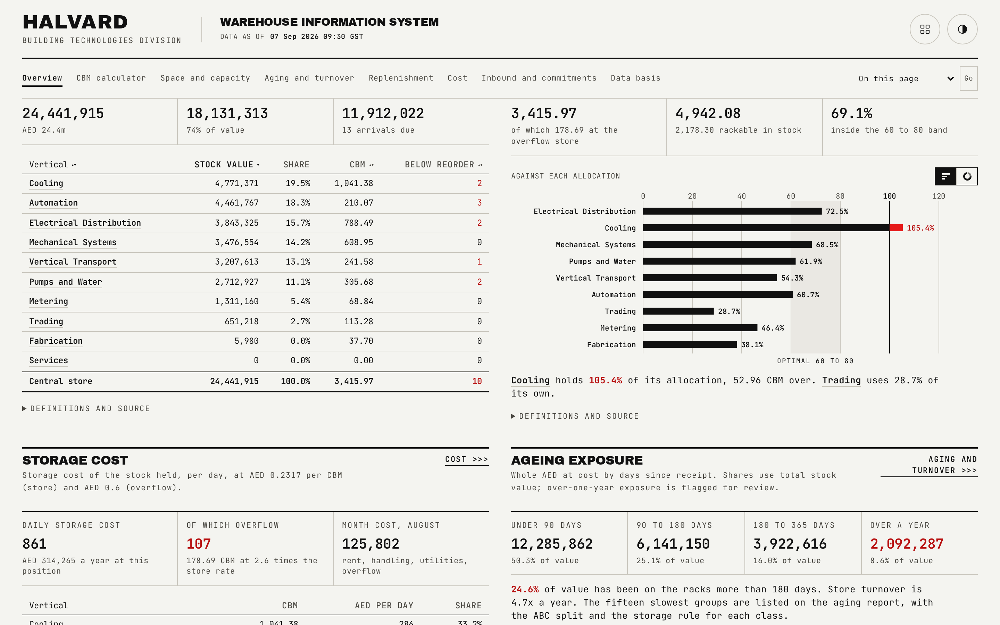

# Overview

The landing page answers the five questions a warehouse manager asks first, in a fixed order: how much value is on the racks, how full the store is, what it costs per day, what is aging, and what will run out.

## What is on the page

- **Answer strip.** Stock value and space utilisation lead as the two primary figures, with daily storage cost, aging exposure and the run-out count as a quieter supporting row directly beneath them.
- **Stock by vertical.** A sortable table of every vertical's stock value, share of the total and CBM, defaulting to stock value descending.
- **Space and allocation.** A utilisation chart with the 60 to 80 percent optimal band marked, plus prose naming which vertical sits over its allocation and which sits well under.
- **Storage cost.** The top five verticals by daily storage cost.
- **Aging exposure.** The four age-band figures and a store-wide turnover line.
- **Replenishment watch.** Every group from the run-out list, which is the union of every group at or under its reorder point and every group projected to run out within 60 days of the stock date, sorted least-cover-first. Each row shows quantity, reorder point, days of cover, the projected stock-out date and any in-transit arrival, with a status tag.

## How the figures are built

Every figure on this page reads from the published rollup file; nothing is computed here. The run-out list is a set union computed once by the generator, not filtered live from two separate lists, so it cannot silently drop a group that qualifies under one rule but not the other. The vertical over its own allocation and the vertical well under it are both deliberately present in the generated data, so this page and the capacity page always have a real example to point at.

## Interactions

The stock-by-vertical table sorts on any column, defaulting to stock value descending. The five anchors (value, space, cost, aging, run-out) are directly reachable and scroll to their section with the heading focused for keyboard and screen-reader users. Table rows reveal with a staggered fade on scroll, skipped entirely under reduced motion.

## See also

- [Space and capacity](02-capacity.md), for the full allocation and four-month projection behind the space figures shown here.
- [Replenishment](04-replenishment.md), for the full 47-group table behind the run-out list.
- [README](../README.md)
