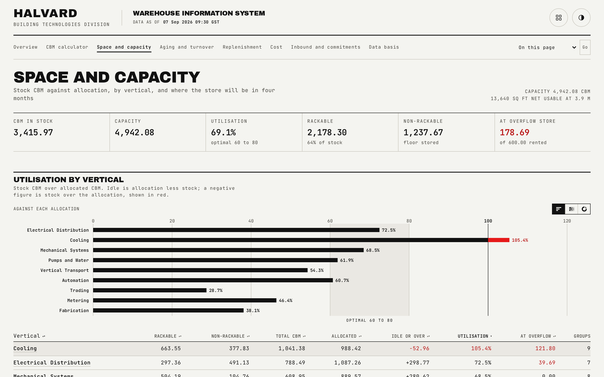

# Space and capacity

Utilisation by vertical against its own allocation, and where the store's space need is heading over the next four months.

## What is on the page

- **Headline strip.** CBM in stock, total capacity, utilisation with its optimal-band note, rackable and non-rackable CBM, and CBM held at the overflow store.
- **Utilisation by vertical.** A chart plus a sortable table (rackable, non-rackable, total CBM, allocated CBM, idle-or-over CBM, utilisation, overflow CBM, group count), defaulting to utilisation descending.
- **Four-month space projection.** A chart plotting the store's total CBM against capacity across the forecast window, prose naming the peak month and its percent of capacity, and a table of every stocked vertical's allocated CBM, current CBM and each projected month-end figure, with any cell that breaches its allocation, or the store's capacity on the total row, marked in hazard red.

## How the figures are built

Each of the ten verticals holds a fixed percentage share of the store's total capacity; the shares sum to exactly 100 percent. A vertical's idle CBM is its allocation minus the CBM it actually holds, so a negative figure means it is stocked over its own share. The overflow store, a third party charging materially more per CBM per day, holds only non-rackable items from a handful of groups, and that CBM still counts toward each vertical's utilisation because the stock exists whether or not it fits on site.

The four-month projection is not a formula applied to a snapshot; it is a day-by-day simulation. Each group's balance falls by its demand per day and never below zero; an order for the gap up to max stock is placed the first day a group's balance is at or under its reorder point with nothing already on order, and lands one lead time later, in whichever month that day falls. The reconciliation gate re-implements this rule independently from the same definition and replays it from the published group files, so the projection cannot drift from the rule that is supposed to produce it.

## Interactions

The vertical table sorts on any column. The utilisation chart marks the 60 to 80 percent optimal band directly on the chart, and the projection chart supports keyboard operation: focus it and use the arrow keys to move a crosshair between months, with the same reading announced for assistive technology that a sighted reader sees on hover.

## See also

- [Overview](01-overview.md), for the store-wide utilisation headline this page's chart supports.
- [Data basis](08-data-basis.md), for the store parameters (floor area, stacking height, rent) that set capacity in the first place.
- [README](../README.md)
