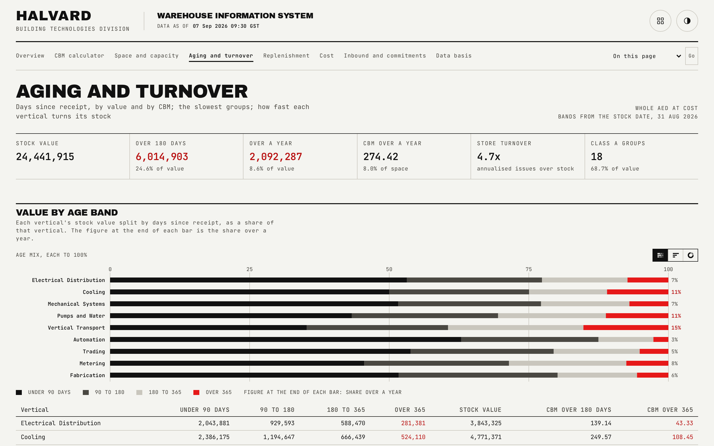
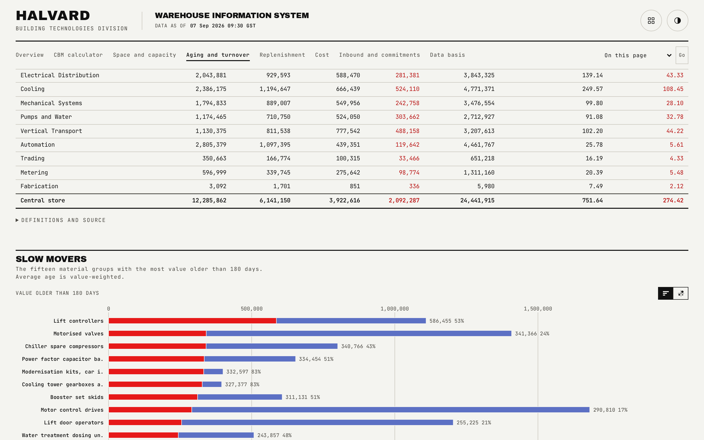

# Aging and turnover

Stock value by age band per vertical, the fifteen slowest-moving material groups, turnover by vertical, and the ABC classification.

## What is on the page

- **Headline strip.** Total stock value, value held over 180 days, value held over a year, CBM held over a year, store-wide turnover, and the count of class A groups.
- **Age bands.** A chart plus a table of the four age bands, with CBM figures over 180 and over 365 days added per vertical.
- **Fifteen slowest movers.** A sortable table (stock value, value over 180 days, share of the group's own value, average age, turnover), defaulting to value over 180 days descending.
- **Turnover by vertical.** A sortable table, slowest first by default.
- **ABC classification.** Every class's group count, value and share, each row carrying a plain-language storage rule for that class.

## How the figures are built

Each group's stock value is split into four age bands (under 90 days, 90 to 180, 180 to 365, and over 365) by an integer split that sums exactly to the group's stock value; CBM by age band follows the same proportion. Average age is value-weighted, using the band midpoints of 45, 135, 270 and 540 days, so a group's age figure reflects where most of its value actually sits rather than a simple average of its oldest and newest units.

ABC classification ranks every group by stock value: class A is the first 70 percent of cumulative value, B the next 20, C the last 10, with the class shares themselves summing to exactly 100.0 by largest remainder. Dead stock, groups with no forecast demand at all, carries no days of cover and no stock-out date; it reads as healthy on the replenishment page but shows up here as a slow mover, which is the only place its real risk is visible.

## Interactions

Both tables sort independently: the slow-movers table on value over 180 days by default, the turnover table on turnover ascending (slowest first) by default. Row reveal is staggered on scroll and skipped under reduced motion.

## See also

- [Replenishment](04-replenishment.md), for why dead stock reads as healthy there but shows its real age exposure here.
- [Overview](01-overview.md), for the store-wide aging headline this page expands on.
- [README](../README.md)
