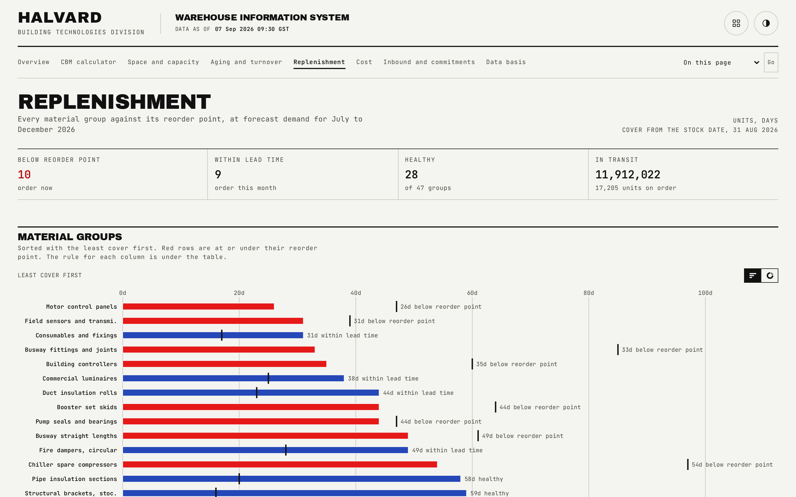

# Replenishment

Every material group against its reorder point, with the rule for each measure stated once rather than repeated per row.

## What is on the page

- **Status strip.** Counts of groups below reorder point, within lead time, healthy, and currently in transit.
- **Full group table.** All 47 material groups, sortable, sticky first column so the group name stays visible while the rest of the row scrolls on a phone, defaulting to days of cover ascending so the most urgent groups lead.
- **Definitions.** A glossary covering safety stock, max stock, lead time, demand, reorder point, days of cover and status, rendered after the table.

## How the figures are built

Safety stock is ten to twenty-five days of forecast demand, set per group. Lead time is days from purchase order to receipt, drawn from that group's vertical's supplier history. Demand per day is forecast quantity for the stated window divided by the window's length, to two decimals. The reorder point is safety stock plus lead time times demand per day, rounded up. Days of cover is quantity over demand per day, rounded down.

Three statuses follow with no hand overrides: below reorder point (order now), within lead time (above the reorder point but days of cover falls within lead time plus 30 days, order this month), and healthy (neither). A group with no forecast demand at all has no days of cover and no stock-out date, so it always reads as healthy here even though it is exactly the kind of stock the aging page is built to surface.

## Interactions

The table sorts on any column; status sorts through its own priority order (below, then within lead time, then healthy) rather than alphabetically, and a group with no days of cover sorts to the very end rather than the top. On a phone the material-group column stays pinned while the rest of the row scrolls horizontally.

## See also

- [Aging and turnover](03-aging.md), for the age exposure a healthy-but-dormant group is carrying that this page cannot show.
- [Overview](01-overview.md), for the run-out list this table's status column feeds.
- [README](../README.md)
