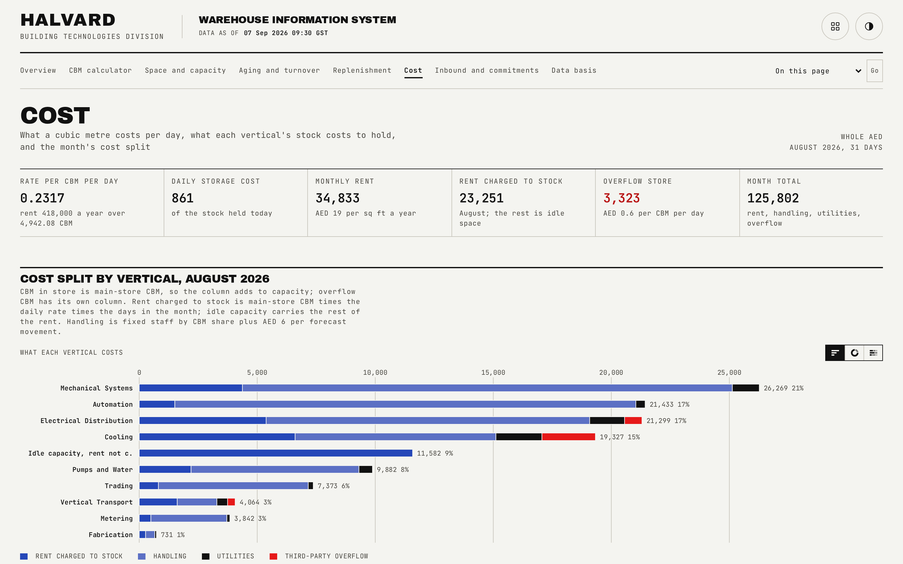
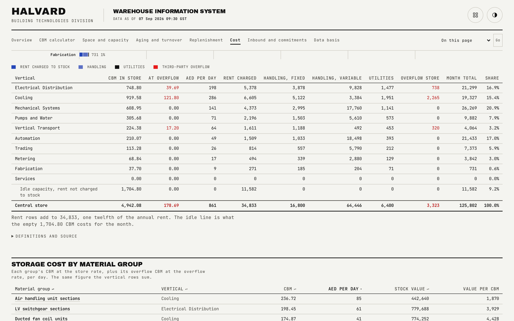

# Cost

The daily storage rate, the month's cost split by vertical, storage cost by material group, and four site options compared on one template.

## What is on the page

- **Headline strip.** Rate per CBM per day, daily storage cost, monthly rent, rent charged to stock this month, overflow store cost, and the month total.
- **Cost split by vertical.** A per-vertical table (main-store CBM, overflow CBM, daily rate, rent charged, fixed and variable handling, utilities, overflow cost, month total, and share of the month total), including an indented idle-capacity row so the rent column always adds to the actual monthly rent, not only to what is charged against stock.
- **Storage cost by material group.** A sortable table, defaulting to daily storage cost descending.
- **Site options.** A four-option decision table (size, annual and monthly rent, rate per square foot, agent commission, effective rate over the option's term), with the cheapest option by effective rate marked.

## How the figures are built

Net usable floor area times stacking height gives the store's capacity in CBM. The daily storage rate is annual rent over 365 days over that capacity, to four decimals, so every group's storage cost derives from one rate. For the stated month, rent charged to stock is each group's main-store CBM times the daily rate times the days in the month, rounded once per group; overflow CBM is charged the same way at the overflow store's own, materially higher, rate. Handling splits into a fixed share (split by CBM share across verticals) and a variable share (forecast movements in the month times a fixed rate per movement). Each row's share of the month total is allocated by largest remainder so the shares sum to exactly 100.0. A site option's annual rent is the sum of its own parts, each an area at a rate, so the blended rate can be checked by hand; the agent commission applies only to the rent on new space.

## Interactions

The material-group table sorts on any column. The cost split table's rent column and CBM columns are built to foot exactly to the store total and to capacity respectively, which is one of the assertions the interaction gate checks directly against the rendered page rather than only against the underlying data.

## See also

- [Data basis](08-data-basis.md), for the store parameters (rent, floor area) the daily rate derives from.
- [Space and capacity](02-capacity.md), for the CBM figures this page's cost split is built on.
- [README](../README.md)
