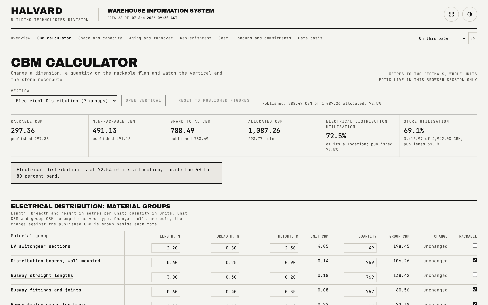

# CBM calculator

The interactive centrepiece: edit a material group's dimensions or quantity in the browser and watch the vertical and store totals move, using the exact rule the generator used to build the published figures.

## What is on the page

- **Vertical selector.** A pending selector with an explicit "Open vertical" action, so a keyboard user browsing options never triggers a context change by accident.
- **Live totals strip.** Rackable CBM, non-rackable CBM, grand total CBM, allocated CBM, this vertical's utilisation, and store utilisation, all recomputed as you type.
- **Status note.** A single line that branches, in priority order, across five states: the store over capacity, this vertical over its own allocation, above the 80 percent optimal ceiling, below the 60 percent floor, or inside the optimal band, plus a separate warning if an invalid field is currently blocking the read.
- **Editable table.** Every group in the selected vertical, with length, breadth, height, unit CBM, quantity, group CBM, the signed change against the published figure, and a rackable checkbox.
- **Reset.** Restores the current vertical's figures to what is published; does not touch any other vertical's retained edits.

## How the figures are built

Unit CBM is length times breadth times height in metres, formed in whole cubic centimetres and rounded once to two decimals, so a true half rounds up rather than drifting down through a floating-point residue (a 1.13 by 1.00 by 0.50 metre item is exactly 0.565 cubic metres and always displays 0.57). Total CBM for a group is unit CBM times quantity, carried in exact hundredths. This is the same function the generator used to build the published figures and the same function the reconciliation script re-checks against, so a calculator edit and a published figure can never silently disagree about what the rule means.

Edits are kept per vertical, keyed by material group, in two pieces: the raw text typed into each field (so an in-progress entry is not lost mid-keystroke) and the last successfully parsed value. Switching verticals does not clear another vertical's edits; only that vertical's own reset button does. The store-wide utilisation figure sums every vertical's live total, including verticals you are not currently viewing, and names which other verticals your retained edits are affecting.

## Interactions

Every field validates on input and reports an inline message pointed to by the field for assistive technology: a negative length, a non-numeric entry, a value past the practical limit, an empty field, a three-decimal length, an exponent-form entry, and a fractional quantity are all caught and explained rather than silently accepted or silently ignored. An unknown vertical in the address bar is corrected to the first vertical that actually holds rows, without discarding a direct link to a specific section.

## See also

- [Space and capacity](02-capacity.md), for the published allocation figures this page lets you test against.
- [Data model](data-model.md), for the full CBM precision policy.
- [README](../README.md)
