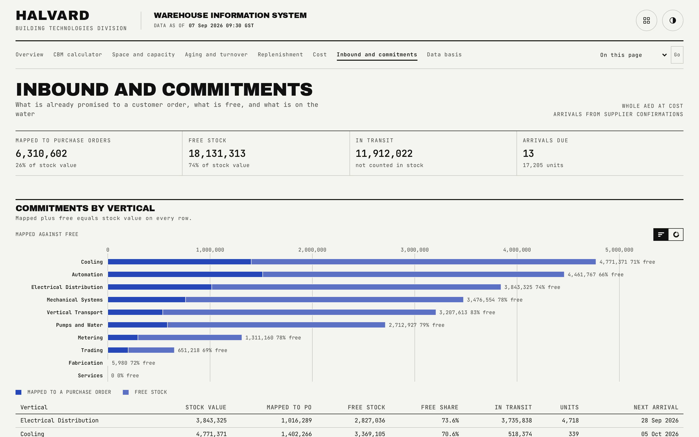

# Inbound and commitments

Stock mapped to purchase orders against free stock, by vertical, and every open in-transit arrival.

## What is on the page

- **Headline strip.** Value mapped to purchase orders, free stock value, value in transit, and the count of arrivals due.
- **Commitments by vertical.** A table of every vertical that actually carries stock or in-transit value, showing what is already committed against a purchase order versus what is genuinely free.
- **Open arrivals.** Every in-transit order, soonest first, each row linking through to its material group's own page.

## How the figures are built

Every group's current stock splits into what is mapped to an outstanding purchase order and what is free, and the two always sum to the group's current stock. In-transit value sits outside current stock entirely; it becomes stock only on the day it is simulated to land in the four-month projection. This is the smallest report page in the application: it renders in the order the generator wrote it, soonest arrival first, with no sorting control and no staggered row reveal.

## Interactions

Each arrival row links directly to the material group it belongs to, so a manager checking a specific incoming shipment can jump straight to that group's own reorder status and history.

## See also

- [Material group detail](09-material-group.md), for the full commitments breakdown behind each row's link.
- [Space and capacity](02-capacity.md), for how in-transit stock is projected forward.
- [README](../README.md)
