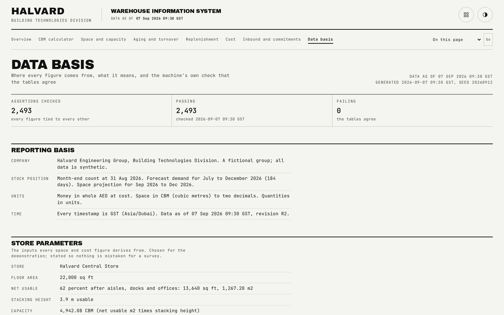

# Data basis

The transparency page: reporting basis, store parameters, the machine's own reconciliation result, the precision policy, every definition and source, and the synthetic assumptions. Every other page's numbers ultimately trace back to a statement here.

## What is on the page

- **Reporting basis.** Company and system name, the stock position and forecast window, units, and the timestamp convention used throughout.
- **Store parameters.** Floor area, net usable share, stacking height, capacity, rent, the daily rate, and the overflow store's own terms.
- **Reconciliation.** A pass or fail badge, and an expandable table listing every one of the 2,493 assertions with both sides of the comparison; any failed assertion sorts to the top and the table opens automatically the moment one exists.
- **Precision policy.** The rounding and aggregation rules stated as an ordered list, the same rules described in the [data model](data-model.md).
- **Definitions and sources.** Every term used elsewhere in the app, defined once here, and every data source named.
- **Assumptions.** The synthetic assumptions the whole demo is built on, stated plainly.

## How the figures are built

This page renders what `scripts/reconcile.ts` already wrote to `public/data/reconciliation.json`; nothing here is computed on the page itself. The reconciliation script re-reads every published file, independent of the generator's own in-memory checks, and asserts that every figure appearing in more than one place agrees exactly and that every derived figure follows its stated rule.

## Interactions

The reconciliation table is a native disclosure element, keyboard-operable by default, and opens automatically whenever at least one assertion has failed so a real problem is never hidden behind a click. Non-integer figures inside an assertion (ratios, percentages) render as plain text rather than being forced through the whole-currency formatter used elsewhere on the page.

## See also

- [Data model](data-model.md), for the full type contract behind everything shown here.
- [Quality gates](quality-gates.md), for what the reconciliation and byte-stability commands prove and how they are run.
- [README](../README.md)
